  

  
  
  

---

### 🚀 About Me
I'm a **Full-Stack AI Engineer** based in Pune, India. I specialize in building **high-performance, production-grade AI systems** and **glossy, premium web applications**. Currently focusing on **Autonomous Agents (MCP)** and **Real-time Scalable Architectures**.

- 🛠️ **Current Projects:** Building Agentic Workflows & SaaS Platforms.
- 🧪 **Researching:** Applied ML in NLP, CV, and Edge AI.
- ⚡ **Performance:** Obsessed with low-latency and smooth UX.

---

### 📊 GitHub Analytics

  
  

  

---

### 🌟 Flagship Projects
<table border="0">
  <tr>
    <td width="50%" valign="top">
      <h4>🌌 Gravity-SaaS-Agent</h4>
      
Multi-tenant AI agent platform with WhatsApp integration, MCP support, and robust billing.

      <code>Next.js</code> <code>TypeScript</code> <code>Tailwind</code> 
      <a href="https://github.com/mangeshraut712/Gravity-SaaS-Agent">🔗 Repository</a>
    </td>
    <td width="50%" valign="top">
      <h4>💼 Career-Agent-Pro</h4>
      
AI job-search copilot. Analyzes roles, tailors resumes, and automates applications.

      <code>Next.js</code> <code>FastAPI</code> <code>OpenAI</code> 
      <a href="https://github.com/mangeshraut712/career-agent-pro">🔗 Repository</a> · <a href="https://ai-job-helper-steel.vercel.app/">🌐 Live Demo</a>
    </td>
  </tr>
  <tr>
    <td width="50%" valign="top">
      <h4>🍲 VoteDine</h4>
      
Real-time group dining decision app. Solve the "where to eat" problem instantly.

      <code>Next.js</code> <code>Fastify</code> <code>PostgreSQL</code> 
      <a href="https://github.com/mangeshraut712/VoteDine">🔗 Repository</a>
    </td>
    <td width="50%" valign="top">
      <h4>🧠 x-algorithm</h4>
      
Social feed ranking simulator with interactive visualizations and Rust core.

      <code>Rust</code> <code>WebAssembly</code> <code>React</code> 
      <a href="https://github.com/mangeshraut712/x-algorithm">🔗 Repository</a> · <a href="https://mangeshraut712.github.io/x-algorithm/">🌐 Live Demo</a>
    </td>
  </tr>
</table>

---

### 🛠️ Tech Stack & Skills

  

---

### 📈 Metrics

  

---

  

