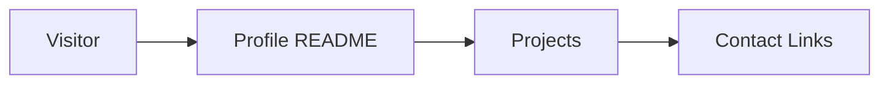

  

  <b>Pune, MH, India</b> · AI + Full‑Stack Engineer building production‑grade web apps and ML systems

  
  
  
  
  
  

---

## About
Full‑Stack AI Engineer focused on **agentic workflows**, **premium UI**, and **production‑grade systems**.

## 2026 Focus
- AI agents for real‑world workflows (MCP, tool orchestration, evals)
- Production SaaS with strict UX, performance, and reliability standards
- Applied ML in NLP & CV (TensorFlow, PyTorch, OpenCV)
- Real‑time systems (WebSockets, streaming, low‑latency UI)

## Signature Work
- Agentic SaaS Platforms — multi‑tenant systems with billing + orchestration
- Applied ML Systems — NLP & CV pipelines from research to product
- Real‑Time Experiences — streaming UIs with performance budgets

## Engineering Principles
- Clarity over complexity  
- Performance budgets from day one  
- Product‑grade UX with measurable outcomes  

---

## Flagship Projects
<table>
  <tr>
    <td width="50%" valign="top">
      <h4>🌌 Gravity‑SaaS‑Agent</h4>
      
Multi‑tenant AI agent platform with WhatsApp + MCP + billing.

      <code>Next.js</code> <code>TypeScript</code> <code>Tailwind</code> 
      <a href="https://github.com/mangeshraut712/Gravity-SaaS-Agent">Repository</a>
    </td>
    <td width="50%" valign="top">
      <h4>💼 Career‑Agent‑Pro</h4>
      
AI job‑search copilot for role analysis, resume tailoring, and automation.

      <code>Next.js</code> <code>FastAPI</code> <code>LLM APIs</code> 
      <a href="https://github.com/mangeshraut712/career-agent-pro">Repository</a> · <a href="https://ai-job-helper-steel.vercel.app/">Live</a>
    </td>
  </tr>
  <tr>
    <td width="50%" valign="top">
      <h4>🍲 VoteDine</h4>
      
Real‑time group dining decision platform.

      <code>Next.js</code> <code>Fastify</code> <code>PostgreSQL</code> 
      <a href="https://github.com/mangeshraut712/VoteDine">Repository</a>
    </td>
    <td width="50%" valign="top">
      <h4>🧠 x‑algorithm</h4>
      
Social feed ranking simulator with interactive tools.

      <code>Rust</code> <code>WebAssembly</code> <code>Web</code> 
      <a href="https://github.com/mangeshraut712/x-algorithm">Repository</a> · <a href="https://mangeshraut712.github.io/x-algorithm/">Live</a>
    </td>
  </tr>
</table>

---

## Live Projects
<table>
  <tr>
    <td width="50%" valign="top">
      <ul>
        <li>Portfolio: https://mangeshraut.pro</li>
        <li>AssistMe: https://assist-me-virtual-assistant.vercel.app/</li>
        <li>Kashish Beauty Parlour: https://kashishbeautyparlour.vercel.app/</li>
        <li>MT Immigration (redesign): https://mt-immigration.vercel.app/</li>
        <li>Alpha Quant Academy: https://alpha-quant-academy.vercel.app/</li>
      </ul>
    </td>
    <td width="50%" valign="top">
      <ul>
        <li>Vidya Raut Portfolio: https://vidyaraut-five.vercel.app/</li>
        <li>CES (redesign): https://ces-ltd-com.vercel.app/</li>
        <li>PicoTuri‑EditJudge: https://pico-turi-edit-judge.vercel.app/</li>
        <li>Bug Reporting System: https://bug-reporting-system-psi.vercel.app/</li>
      </ul>
    </td>
  </tr>
</table>

---

## Tech Stack & Tools

  

  

---

## GitHub Metrics

  

  

---

<!-- codex:project-diagram:start -->

## Project Diagram

```mermaid
flowchart LR
    A["Visitor"] --> B["Profile README"]
    B --> C["Projects"]
    C --> D["Contact Links"]
```

_How the profile README routes visitors toward projects and contact channels._

<!-- codex:project-diagram:end -->
