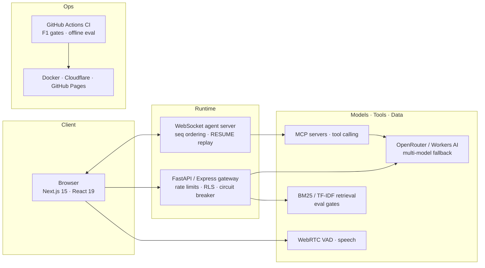

<!-- Apple-inspired engineering portfolio · black / white / #0071E3 · Sep 2026 -->

<p align="center">
  <picture>
    <source media="(prefers-color-scheme: dark)" srcset="https://raw.githubusercontent.com/mangeshraut712/mangeshraut712/main/banner-dark.svg?v=2026091701" />
    <source media="(prefers-color-scheme: light)" srcset="https://raw.githubusercontent.com/mangeshraut712/mangeshraut712/main/banner-light.svg?v=2026091701" />
    
  </picture>
</p>

> [!IMPORTANT]
> **Open to AI Engineer roles (Pune · remote).** I build the production *shape* of AI systems: agents with tool calling and failure handling, real-time speech VAD with an F1 gate, an offline RAG eval harness, and the full-stack around them. Every number below links to the file or CI run that produced it — stub metrics are labelled stub.
> Fastest contact: [mbr63drexel@gmail.com](mailto:mbr63drexel@gmail.com)

<p align="center">
  <a href="https://mangeshraut712.github.io/mangeshrautarchive/"></a>
  <a href="https://www.linkedin.com/in/mangeshraut71298/"></a>
  <a href="https://www.instagram.com/mangesh_d_charming_guy/"></a>
  <a href="https://wa.me/917276819090"></a>
  <a href="https://x.com/mrcommando712"></a>
</p>

<p align="center">
  <a href="https://github.com/sponsors/mangeshraut712"></a>
  <a href="https://buy.stripe.com/14A3cufGUgcV5ePfuA14401"></a>
  <a href="https://www.paypal.com/ncp/payment/LXNHJ5SUGNP82"></a>
  <a href="https://www.buymeacoffee.com/mangeshraut"></a>
</p>

---

### Start here — three systems, end to end

| Project | What it proves | Guardrails / failure handling | Proof |
| --- | --- | --- | --- |
| [**ai-ml-portfolio**](https://github.com/mangeshraut712/ai-ml-portfolio) — speech VAD + RAG eval + NumPy ML from scratch | Measured VAD F1 gates (real audio + synthetic labels). Offline RAG/LLM eval harness with retrieval metrics; CI uses **stub** providers, not live APIs | Acceptance gate (`challenge_pass.py`) fails CI below fixed thresholds; eval harness falls back to stubs when keys are missing so CI never depends on a live API | [MODEL_CARD](https://github.com/mangeshraut712/ai-ml-portfolio/blob/main/labs/vad/MODEL_CARD.md) · [RESULTS](https://github.com/mangeshraut712/ai-ml-portfolio/blob/main/labs/llm-eval/RESULTS.md) |
| [**agent-console**](https://github.com/mangeshraut712/agent-console) — real-time agent debug UI over WebSocket | Streaming tokens, tool-call traces, protocol observability for agent backends | Seq-based reorder buffer with dedupe, `RESUME {last_seq}` replay after disconnect, single-fire `TOOL_ACK`, chaos-mode verification (`npm run verify:chaos`) | [DECISIONS.md](https://github.com/mangeshraut712/agent-console/blob/main/DECISIONS.md) · [live demo](https://mangeshraut712.github.io/agent-console/) |
| [**Gravity-SaaS-Agent**](https://github.com/mangeshraut712/Gravity-SaaS-Agent) — multi-tenant agent SaaS starter (Next.js dashboard + Express gateway) | MCP client, skills engine, billing events, operator dashboard | Tier-based `express-rate-limit`, Supabase RLS policies, circuit breaker, OpenRouter fallback. WhatsApp/Telegram adapters in-repo are **simulators** (`enhanced-channels.ts`), not live Business API traffic | [README](https://github.com/mangeshraut712/Gravity-SaaS-Agent#readme) · [CI](https://github.com/mangeshraut712/Gravity-SaaS-Agent/actions/workflows/ci.yml) |

**Reproduce the headline number in one command** (Python 3.10–3.12, no API keys):

```bash
git clone https://github.com/mangeshraut712/ai-ml-portfolio && cd ai-ml-portfolio
make install && make verify-all      # mlfs tests + VAD FULL_PASS gate + offline LLM eval
```

---

### Engineering metrics — measured, with baselines and a failure case

<p align="center">
  <picture>
    <source media="(prefers-color-scheme: dark)" srcset="https://raw.githubusercontent.com/mangeshraut712/mangeshraut712/main/metrics-dark.svg?v=202609170126" />
    <source media="(prefers-color-scheme: light)" srcset="https://raw.githubusercontent.com/mangeshraut712/mangeshraut712/main/metrics-light.svg?v=202609170126" />
    
  </picture>
</p>

Headline numbers on the card: VAD clean F1 **0.9569**, VAD p95 **~19 ms** (measured; the code gate is ≤100 ms), CI Python **3.10–3.12**, **4,857** contributions (**2026-09-16 snapshot** — live total moves). The table is only what the card does not show.

| Metric | Measured | Gate / baseline | Source |
| --- | ---: | ---: | --- |
| VAD exact F1, noisy — **known failure mode** | **0.7768** | gate ≥ 0.75 (clean gate is ≥ 0.92) | [challenge_pass.py](https://github.com/mangeshraut712/ai-ml-portfolio/blob/main/labs/vad/challenge_pass.py) · [MODEL_CARD](https://github.com/mangeshraut712/ai-ml-portfolio/blob/main/labs/vad/MODEL_CARD.md) |
| VAD soft F1 | **0.8135** | gate ≥ 0.78 | same |
| RAG retrieval **(offline stub, not live models)** — TF-IDF Recall@5 · MRR · nDCG@5 | **1.000 · 0.981 · 0.986** | 40 gold QA + 15 adversarial on 10 FAQ docs. BM25-fusion stub is Recall@3 **0.975** (different cut). Hallucination 0.000 is the stub generator abstaining | [RESULTS.md](https://github.com/mangeshraut712/ai-ml-portfolio/blob/main/labs/llm-eval/RESULTS.md) (mode STUB, 2026-07-24) · [DATA_CARD](https://github.com/mangeshraut712/ai-ml-portfolio/blob/main/labs/llm-eval/DATA_CARD.md) |
| Stub cost / latency matrix | p95 ms and $/1k queries per **stub** provider | optional live path is `EVAL_LIVE=1`; CI never sets it | same RESULTS.md |
| CI run for `make verify-all` | green | — | [Sep 11, 2026](https://github.com/mangeshraut712/ai-ml-portfolio/actions/runs/34574401205) |

---

### Open-source contributions

| Project | Contribution | Status |
| --- | --- | --- |
| [MoonshotAI / Kimi Code](https://github.com/MoonshotAI/kimi-code/pull/2416) | Built-in model catalog fallback when `models.dev` is unavailable | **Merged** |
| [Sarvam AI Cookbook](https://github.com/sarvamai/sarvam-ai-cookbook/pull/116) | Hardened CI detection of unquoted TS/JS model keys | **Merged** |
| [Apple Password Manager Resources](https://github.com/apple/password-manager-resources/pull/1178) | Schema support for exact-domain-only password rules | **Merged** |
| [Apple Password Manager Resources](https://github.com/apple/password-manager-resources/pull/1179) | Shared-credential mappings for Bluesky domains | **Merged** |
| [OpenAI Codex Security](https://github.com/openai/codex-security/pull/754) | Shell-neutral env-var removal guidance in the CLI | **Merged** |
| [Apple Password Manager Resources](https://github.com/apple/password-manager-resources/pull/1239) | Shared-credential mapping for HDFC Bank (`hdfcbank.com` → `hdfc.bank.in`) | **Merged** |
| [Meta Pyrefly](https://github.com/facebook/pyrefly/pull/4737) | LSP completion for closing triple-quoted strings | Open |
| [Meta Lexical iOS](https://github.com/facebook/lexical-ios/pull/85) | DocC documentation for `ElementNode` methods | Open |
| [Anthropic claude-code-action](https://github.com/anthropics/claude-code-action/pull/1821) | Docs: `claude_args` replaces removed `allowed_tools` | Open |

Full list: [merged](https://github.com/pulls?q=is%3Apr+author%3Amangeshraut712+is%3Amerged+-user%3Amangeshraut712) · [open](https://github.com/pulls?q=is%3Apr+author%3Amangeshraut712+is%3Aopen+-user%3Amangeshraut712)

---

### More projects

The three systems above stay in **Start here**. These cards are everything else.

<p align="center">
  <picture>
    <source media="(prefers-color-scheme: dark)" srcset="https://raw.githubusercontent.com/mangeshraut712/mangeshraut712/main/projects-dark.svg?v=2026091712" />
    <source media="(prefers-color-scheme: light)" srcset="https://raw.githubusercontent.com/mangeshraut712/mangeshraut712/main/projects-light.svg?v=2026091712" />
    
  </picture>
</p>

---

<details>
<summary><b>Architecture</b> — how the pieces connect (Mermaid, renders natively)</summary>


```mermaid
flowchart LR
  subgraph Client
    B[Browser<br/>Next.js 15 · React 19]
  end
  subgraph Runtime
    WS[WebSocket agent server<br/>seq ordering · RESUME replay]
    API[FastAPI / Express gateway<br/>rate limits · RLS · circuit breaker]
  end
  subgraph Models_Tools_Data["Models · Tools · Data"]
    OR[OpenRouter / Workers AI<br/>multi-model fallback]
    MCP[MCP servers · tool calling]
    VAD[WebRTC VAD · speech]
    RAG[BM25 / TF-IDF retrieval<br/>eval gates]
  end
  subgraph Ops
    CI[GitHub Actions CI<br/>F1 gates · offline eval]
    DEP[Docker · Cloudflare · GitHub Pages]
  end
  B <--> WS
  B --> API
  WS --> MCP
  API --> OR
  API --> RAG
  B --> VAD
  MCP --> OR
  CI --> DEP
```

</details>

<details>
<summary><b>AI engineering stack</b> — every claim points at a dependency file</summary>

<p align="center">
  <picture>
    <source media="(prefers-color-scheme: dark)" srcset="https://raw.githubusercontent.com/mangeshraut712/mangeshraut712/main/stack-dark.svg?v=20260906f" />
    <source media="(prefers-color-scheme: light)" srcset="https://raw.githubusercontent.com/mangeshraut712/mangeshraut712/main/stack-light.svg?v=20260906f" />
    
  </picture>
</p>

The card lists tools I use. **Only the lockfiles below are claims about these repos.** PyTorch / Ollama / DeepSeek on the card are local/tooling names, not pinned dependencies here.

| Stack claim | Source |
| --- | --- |
| NumPy · webrtcvad · rank-bm25 · scikit-learn | [ai-ml-portfolio/pyproject.toml](https://github.com/mangeshraut712/ai-ml-portfolio/blob/main/pyproject.toml) |
| Next.js 15.3 · React 19.1 · Turbopack | [agent-console/package.json](https://github.com/mangeshraut712/agent-console/blob/main/package.json) |
| Next.js 15.5 · React 19.2 · Cloudflare Workers AI | [Hindai/package.json](https://github.com/mangeshraut712/Hindai/blob/main/package.json) · [workers/hindai-gemma](https://github.com/mangeshraut712/Hindai/tree/main/workers) |
| Next.js 15.5 dashboard · Express gateway · Supabase | [Gravity-SaaS-Agent/apps](https://github.com/mangeshraut712/Gravity-SaaS-Agent/tree/main/apps) |
| FastAPI | [mangeshrautarchive/requirements.txt](https://github.com/mangeshraut712/mangeshrautarchive/blob/main/requirements.txt) · [career-agent-pro/backend](https://github.com/mangeshraut712/career-agent-pro/blob/main/backend/requirements.txt) |
| Sarvam SDK | [Realtime_Speech_Captioning/requirements.txt](https://github.com/mangeshraut712/sarvam-ai-cookbook/blob/main/examples/Realtime_Speech_Captioning/requirements.txt) |

</details>

<details>
<summary><b>Now</b> — what I'm building this quarter</summary>

<p align="center">
  <picture>
    <source media="(prefers-color-scheme: dark)" srcset="https://raw.githubusercontent.com/mangeshraut712/mangeshraut712/main/focus-dark.svg?v=20260906f" />
    <source media="(prefers-color-scheme: light)" srcset="https://raw.githubusercontent.com/mangeshraut712/mangeshraut712/main/focus-light.svg?v=20260906f" />
    
  </picture>
</p>

</details>

<details>
<summary><b>Principles, writing, trajectory</b></summary>

**Engineering principles**

- Measure everything; ship the gate with the number
- Local-first whenever possible; CI must not depend on a live API
- Reliability over novelty — an agent with guardrails beats a flashier one without
- AI should augment, not obscure, the system
- Developer experience matters; simple systems scale better

Details: [INTERVIEW_NOTES.md](https://github.com/mangeshraut712/ai-ml-portfolio/blob/main/INTERVIEW_NOTES.md)

**Writing**

- [Technical writings RSS](https://mangeshraut712.github.io/mangeshrautarchive/rss.xml)

**Trajectory**

<p align="center">
  <picture>
    <source media="(prefers-color-scheme: dark)" srcset="https://raw.githubusercontent.com/mangeshraut712/mangeshraut712/main/trajectory-dark.svg?v=20260906f" />
    <source media="(prefers-color-scheme: light)" srcset="https://raw.githubusercontent.com/mangeshraut712/mangeshraut712/main/trajectory-light.svg?v=20260906f" />
    
  </picture>
</p>

<p align="center">
  <a href="https://github.com/mangeshraut712?tab=overview&from=2021-01-01&to=2026-12-31">Contribution graph</a>
  ·
  <a href="https://github.com/mangeshraut712/mangeshraut712/blob/main/data/github-snapshot.json">yearly snapshot JSON</a>
</p>

</details>
