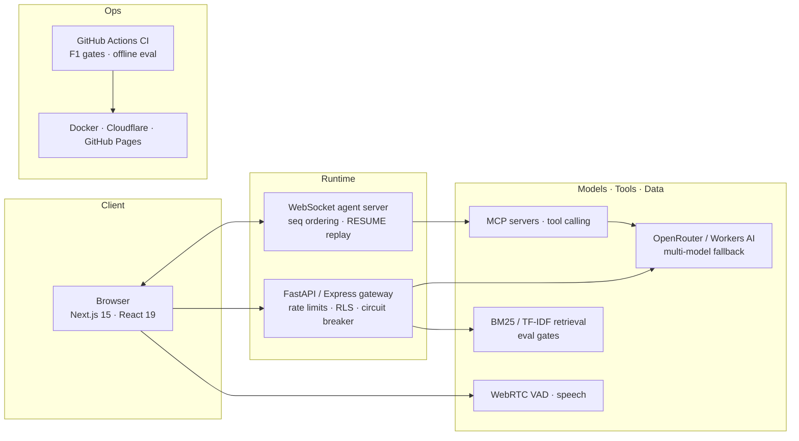

<!-- Apple-inspired engineering portfolio · black / white / #0071E3 · Sep 2026 -->

<p align="center">
  <picture>
    <source media="(prefers-color-scheme: dark)" srcset="https://raw.githubusercontent.com/mangeshraut712/mangeshraut712/main/banner-dark.svg?v=2026091618" />
    <source media="(prefers-color-scheme: light)" srcset="https://raw.githubusercontent.com/mangeshraut712/mangeshraut712/main/banner-light.svg?v=2026091618" />
    
  </picture>
</p>

> [!IMPORTANT]
> **Open to AI Engineer roles (Pune · remote).** I build production AI: agents with tool calling and failure handling, real-time speech VAD, RAG evaluation harnesses, and the full-stack around them. Every number below links to the file or CI run that produced it.
> Fastest contact: [mbr63drexel@gmail.com](mailto:mbr63drexel@gmail.com) · [LinkedIn](https://www.linkedin.com/in/mangeshraut71298/) · [Portfolio](https://mangeshraut712.github.io/mangeshrautarchive/)

<p align="center">
  <a href="https://mangeshraut712.github.io/mangeshrautarchive/"></a>
  <a href="https://www.linkedin.com/in/mangeshraut71298/"></a>
  <a href="mailto:mbr63drexel@gmail.com"></a>
  <a href="https://wa.me/917276819090"></a>
  <a href="https://x.com/mrcommando712"></a>
</p>

---

### Start here — three systems, end to end

| Project | What it proves | Guardrails / failure handling | Proof |
| --- | --- | --- | --- |
| [**ai-ml-portfolio**](https://github.com/mangeshraut712/ai-ml-portfolio) — speech VAD + RAG eval + NumPy ML from scratch | Measured, reproducible ML: labeled F1 gates, an offline eval harness with retrieval metrics, faithfulness, hallucination rate, latency and $/1k-query matrix | Acceptance gate (`challenge_pass.py`) fails CI below fixed thresholds; eval harness falls back to stubs when keys are missing so CI never depends on a live API | [CI · Sep 11, 2026](https://github.com/mangeshraut712/ai-ml-portfolio/actions/runs/34574401205) · [MODEL_CARD](https://github.com/mangeshraut712/ai-ml-portfolio/blob/main/labs/vad/MODEL_CARD.md) · [RESULTS](https://github.com/mangeshraut712/ai-ml-portfolio/blob/main/labs/llm-eval/RESULTS.md) |
| [**agent-console**](https://github.com/mangeshraut712/agent-console) — real-time agent debug UI over WebSocket | Streaming tokens, tool-call traces, protocol observability for agent backends | Seq-based reorder buffer with dedupe, `RESUME {last_seq}` replay after disconnect, single-fire `TOOL_ACK`, chaos-mode verification (`npm run verify:chaos`) | [DECISIONS.md](https://github.com/mangeshraut712/agent-console/blob/main/DECISIONS.md) · [live demo](https://mangeshraut712.github.io/agent-console/) |
| [**Gravity-SaaS-Agent**](https://github.com/mangeshraut712/Gravity-SaaS-Agent) — multi-tenant AI agent SaaS (web, WhatsApp, Telegram, API) | Agents as a product: MCP client, skills engine, billing, operator dashboard | Tier-based rate limits, Supabase Row Level Security per tenant, circuit breaker on model calls, OpenRouter multi-model fallback | [README](https://github.com/mangeshraut712/Gravity-SaaS-Agent#readme) · [CI](https://github.com/mangeshraut712/Gravity-SaaS-Agent/actions/workflows/ci.yml) |

**Reproduce the headline number in one command** (Python 3.10–3.12, no API keys):

```bash
git clone https://github.com/mangeshraut712/ai-ml-portfolio && cd ai-ml-portfolio
make install && make verify-all      # mlfs tests + VAD FULL_PASS gate + offline LLM eval
```

---

### Engineering metrics — measured, with baselines and a failure case

<p align="center">
  <picture>
    <source media="(prefers-color-scheme: dark)" srcset="https://raw.githubusercontent.com/mangeshraut712/mangeshraut712/main/metrics-dark.svg?v=202609161850" />
    <source media="(prefers-color-scheme: light)" srcset="https://raw.githubusercontent.com/mangeshraut712/mangeshraut712/main/metrics-light.svg?v=202609161850" />
    
  </picture>
</p>

| Metric | Measured | Gate / baseline | Source |
| --- | ---: | ---: | --- |
| VAD exact F1, clean | **0.9569** | gate ≥ 0.92 (min per-file ≥ 0.90) | [challenge_pass.py](https://github.com/mangeshraut712/ai-ml-portfolio/blob/main/labs/vad/challenge_pass.py) |
| VAD exact F1, noisy — **known failure mode** | **0.7768** | gate ≥ 0.75 | same; spectral gate + WebRTC GMM degrades under broadband noise, see [MODEL_CARD](https://github.com/mangeshraut712/ai-ml-portfolio/blob/main/labs/vad/MODEL_CARD.md) |
| VAD soft F1 | **0.8135** | gate ≥ 0.78 | same |
| VAD steady-state p95 latency | **~19 ms** / 30 ms frame | real-time budget 30 ms | [ai-ml-portfolio README](https://github.com/mangeshraut712/ai-ml-portfolio/blob/main/README.md) |
| RAG retrieval (TF-IDF → BM25 fusion), Recall@5 · MRR · nDCG@5 | **1.000 · 0.981 · 0.986** | 40 gold QA + 15 adversarial, hallucination rate 0.000 | [RESULTS.md](https://github.com/mangeshraut712/ai-ml-portfolio/blob/main/labs/llm-eval/RESULTS.md) (offline stub mode in CI; live providers optional) |
| Cost & latency tracking | p95 ms and $/1k queries per provider, emitted by the harness | — | [RESULTS.md](https://github.com/mangeshraut712/ai-ml-portfolio/blob/main/labs/llm-eval/RESULTS.md) · [DATA_CARD](https://github.com/mangeshraut712/ai-ml-portfolio/blob/main/labs/llm-eval/DATA_CARD.md) |
| CI | Python **3.10–3.12** matrix green | — | [run · Sep 11, 2026](https://github.com/mangeshraut712/ai-ml-portfolio/actions/runs/34574401205) |
| **4,857** all-time contributions (2026-09-16 snapshot) | — | — | [overview](https://github.com/mangeshraut712?tab=overview&from=2021-01-01&to=2026-12-31) · [snapshot JSON](https://github.com/mangeshraut712/mangeshraut712/blob/main/data/github-snapshot.json) |

---

### Open-source contributions

| Project | Contribution | Status |
| --- | --- | --- |
| [MoonshotAI / Kimi Code](https://github.com/MoonshotAI/kimi-code/pull/2416) | Built-in model catalog fallback when `models.dev` is unavailable | **Merged** |
| [Sarvam AI Cookbook](https://github.com/sarvamai/sarvam-ai-cookbook/pull/116) | Hardened CI detection of unquoted TS/JS model keys | **Merged** |
| [Apple Password Manager Resources](https://github.com/apple/password-manager-resources/pull/1178) | Schema support for exact-domain-only password rules | **Merged** |
| [Apple Password Manager Resources](https://github.com/apple/password-manager-resources/pull/1179) | Shared-credential mappings for Bluesky domains | **Merged** |
| [OpenAI Codex Security](https://github.com/openai/codex-security/pull/754) | Shell-neutral env-var removal guidance in the CLI | **Merged** |
| [Apple Password Manager Resources](https://github.com/apple/password-manager-resources/pull/1239) | Shared-credential mapping for HDFC Bank (`hdfcbank.com` → `hdfc.bank.in`) | **Merged** |
| [Meta Pyrefly](https://github.com/facebook/pyrefly/pull/4737) | LSP completion for closing triple-quoted strings | Open |
| [Meta Lexical iOS](https://github.com/facebook/lexical-ios/pull/85) | DocC documentation for `ElementNode` methods | Open |
| [Anthropic claude-code-action](https://github.com/anthropics/claude-code-action/pull/1821) | Docs: `claude_args` replaces removed `allowed_tools` | Open |

Full list: [merged](https://github.com/pulls?q=is%3Apr+author%3Amangeshraut712+is%3Amerged+-user%3Amangeshraut712) · [open](https://github.com/pulls?q=is%3Apr+author%3Amangeshraut712+is%3Aopen+-user%3Amangeshraut712)

---

### More projects

<p align="center">
  <picture>
    <source media="(prefers-color-scheme: dark)" srcset="https://raw.githubusercontent.com/mangeshraut712/mangeshraut712/main/projects-dark.svg?v=20260917" />
    <source media="(prefers-color-scheme: light)" srcset="https://raw.githubusercontent.com/mangeshraut712/mangeshraut712/main/projects-light.svg?v=20260917" />
    
  </picture>
</p>

| Repo | One line | Agent-era notes |
| --- | --- | --- |
| [codex-insights](https://github.com/mangeshraut712/codex-insights) | `$insights` Codex skill + CLI: private HTML/JSON reports from local Codex sessions, trust-aware, `--local-only` by default | Follows the Codex plugin ingestion contract (manifest, skill, `validate_plugin.py`) |
| [Hindai](https://github.com/mangeshraut712/Hindai) | Static-first Indic scripture learning site; Gemma 4 via a Cloudflare Worker, optional OpenRouter | Rate limiting via Upstash; scripture/tirtha/festival content runs fully offline on Pages |
| [erdos142](https://github.com/mangeshraut712/erdos142) | Offline research notebook for Erdős #142 — exact finite verifiers for a density-increment route to r₄(N)=o(N/log N) | Status OPEN, no theorem claimed; every audit ships a stdlib-only checker + JSON |
| [Vitals.AI](https://github.com/mangeshraut712/Vitals.AI) | Privacy-first health dashboard and agent tools; Pages demo uses sample data | — |
| [Stanford-CS336](https://github.com/mangeshraut712/Stanford-CS336) | Self-study labs: BPE, transformers, GRPO | — |
| [sarvam-ai-cookbook](https://github.com/mangeshraut712/sarvam-ai-cookbook) (upstream fork) | Indic speech/RAG examples; my CI fix is merged upstream | — |

---

<details>
<summary><b>Architecture</b> — how the pieces connect (Mermaid, renders natively)</summary>


```mermaid
flowchart LR
  subgraph Client
    B[Browser<br/>Next.js 15 · React 19]
  end
  subgraph Runtime
    WS[WebSocket agent server<br/>seq ordering · RESUME replay]
    API[FastAPI / Express gateway<br/>rate limits · RLS · circuit breaker]
  end
  subgraph Models_Tools_Data["Models · Tools · Data"]
    OR[OpenRouter / Workers AI<br/>multi-model fallback]
    MCP[MCP servers · tool calling]
    VAD[WebRTC VAD · speech]
    RAG[BM25 / TF-IDF retrieval<br/>eval gates]
  end
  subgraph Ops
    CI[GitHub Actions CI<br/>F1 gates · offline eval]
    DEP[Docker · Cloudflare · GitHub Pages]
  end
  B <--> WS
  B --> API
  WS --> MCP
  API --> OR
  API --> RAG
  B --> VAD
  MCP --> OR
  CI --> DEP
```

</details>

<details>
<summary><b>AI engineering stack</b> — every claim points at a dependency file</summary>

<p align="center">
  <picture>
    <source media="(prefers-color-scheme: dark)" srcset="https://raw.githubusercontent.com/mangeshraut712/mangeshraut712/main/stack-dark.svg?v=20260906f" />
    <source media="(prefers-color-scheme: light)" srcset="https://raw.githubusercontent.com/mangeshraut712/mangeshraut712/main/stack-light.svg?v=20260906f" />
    
  </picture>
</p>

| Stack claim | Source |
| --- | --- |
| NumPy · webrtcvad · rank-bm25 · scikit-learn | [ai-ml-portfolio/pyproject.toml](https://github.com/mangeshraut712/ai-ml-portfolio/blob/main/pyproject.toml) |
| Next.js 15.3 · React 19.1 · Turbopack | [agent-console/package.json](https://github.com/mangeshraut712/agent-console/blob/main/package.json) |
| Next.js 15.5 · React 19.2 · Cloudflare Workers AI | [Hindai/package.json](https://github.com/mangeshraut712/Hindai/blob/main/package.json) · [workers/hindai-gemma](https://github.com/mangeshraut712/Hindai/tree/main/workers) |
| Next.js 15.5 dashboard · Express gateway · Supabase | [Gravity-SaaS-Agent/apps](https://github.com/mangeshraut712/Gravity-SaaS-Agent/tree/main/apps) |
| FastAPI | [mangeshrautarchive/requirements.txt](https://github.com/mangeshraut712/mangeshrautarchive/blob/main/requirements.txt) · [career-agent-pro/backend](https://github.com/mangeshraut712/career-agent-pro/blob/main/backend/requirements.txt) |
| Sarvam SDK (upstream cookbook fork) | [Realtime_Speech_Captioning/requirements.txt](https://github.com/mangeshraut712/sarvam-ai-cookbook/blob/main/examples/Realtime_Speech_Captioning/requirements.txt) |
| Speech VAD lab | [labs/vad](https://github.com/mangeshraut712/ai-ml-portfolio/tree/main/labs/vad) |
| RAG / LLM eval lab | [labs/llm-eval](https://github.com/mangeshraut712/ai-ml-portfolio/tree/main/labs/llm-eval) · [DATA_CARD](https://github.com/mangeshraut712/ai-ml-portfolio/blob/main/labs/llm-eval/DATA_CARD.md) · [RESULTS](https://github.com/mangeshraut712/ai-ml-portfolio/blob/main/labs/llm-eval/RESULTS.md) |

</details>

<details>
<summary><b>Now</b> — what I'm building this quarter</summary>

<p align="center">
  <picture>
    <source media="(prefers-color-scheme: dark)" srcset="https://raw.githubusercontent.com/mangeshraut712/mangeshraut712/main/focus-dark.svg?v=20260906f" />
    <source media="(prefers-color-scheme: light)" srcset="https://raw.githubusercontent.com/mangeshraut712/mangeshraut712/main/focus-light.svg?v=20260906f" />
    
  </picture>
</p>

</details>

<details>
<summary><b>Principles, writing, trajectory</b></summary>

**Engineering principles**

- Measure everything; ship the gate with the number
- Local-first whenever possible; CI must not depend on a live API
- Reliability over novelty — an agent with guardrails beats a flashier one without
- AI should augment, not obscure, the system
- Developer experience matters; simple systems scale better

Details: [INTERVIEW_NOTES.md](https://github.com/mangeshraut712/ai-ml-portfolio/blob/main/INTERVIEW_NOTES.md)

**Writing / notes**

- [Technical writings RSS](https://mangeshraut712.github.io/mangeshrautarchive/rss.xml)
- [LLM eval DATA_CARD](https://github.com/mangeshraut712/ai-ml-portfolio/blob/main/labs/llm-eval/DATA_CARD.md)
- [Stanford CS336](https://github.com/mangeshraut712/Stanford-CS336)
- [Erdős #142 research notebook](https://github.com/mangeshraut712/erdos142) — offline audits and exact finite verifiers; status OPEN, no new theorem claimed

**Trajectory**

<p align="center">
  <picture>
    <source media="(prefers-color-scheme: dark)" srcset="https://raw.githubusercontent.com/mangeshraut712/mangeshraut712/main/trajectory-dark.svg?v=20260906f" />
    <source media="(prefers-color-scheme: light)" srcset="https://raw.githubusercontent.com/mangeshraut712/mangeshraut712/main/trajectory-light.svg?v=20260906f" />
    
  </picture>
</p>

<p align="center">
  <a href="https://github.com/mangeshraut712?tab=overview&from=2021-01-01&to=2026-12-31">Contribution graph</a>
  ·
  <a href="https://github.com/mangeshraut712/mangeshraut712/blob/main/data/github-snapshot.json">yearly snapshot JSON</a>
</p>

</details>

<p align="center">
  <a href="https://github.com/sponsors/mangeshraut712"></a>
  <a href="https://buy.stripe.com/14A3cufGUgcV5ePfuA14401"></a>
  <a href="https://www.paypal.com/ncp/payment/LXNHJ5SUGNP82"></a>
  <a href="https://www.buymeacoffee.com/mangeshraut"></a>
</p>
